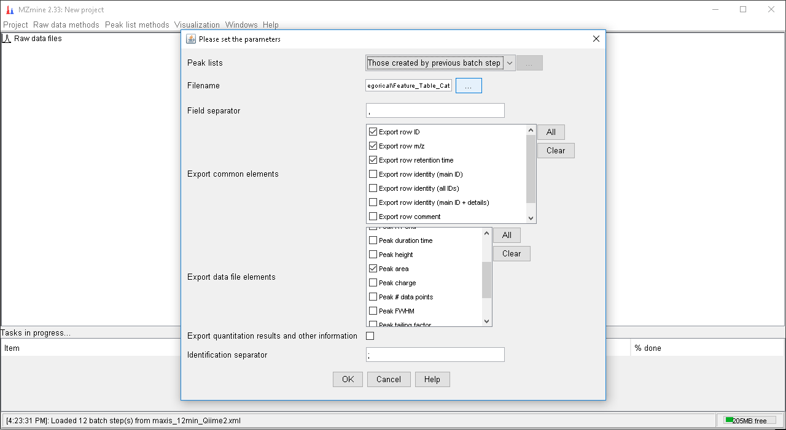
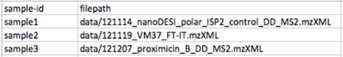
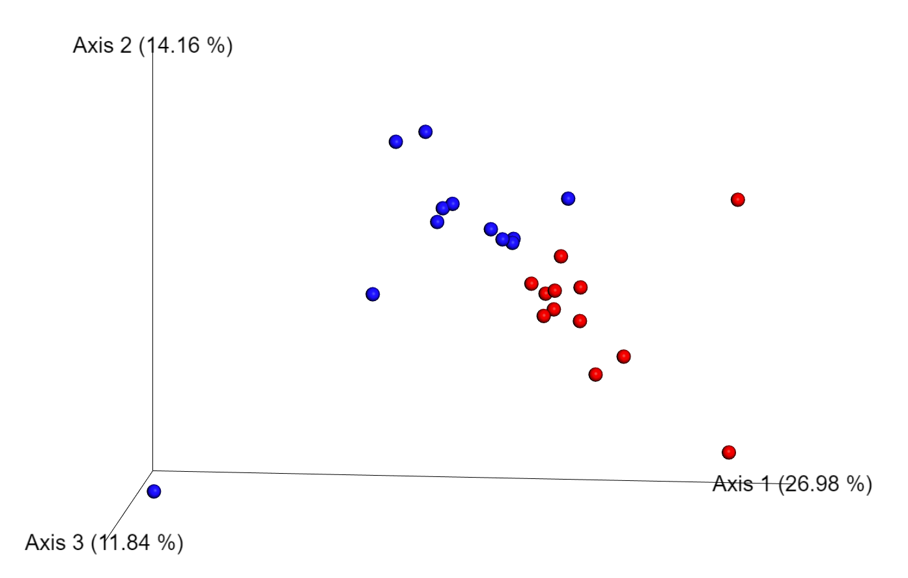
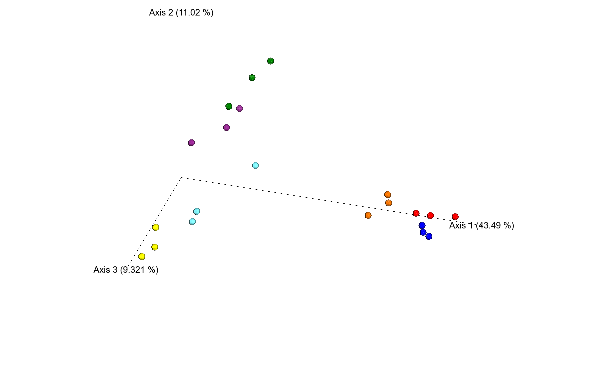
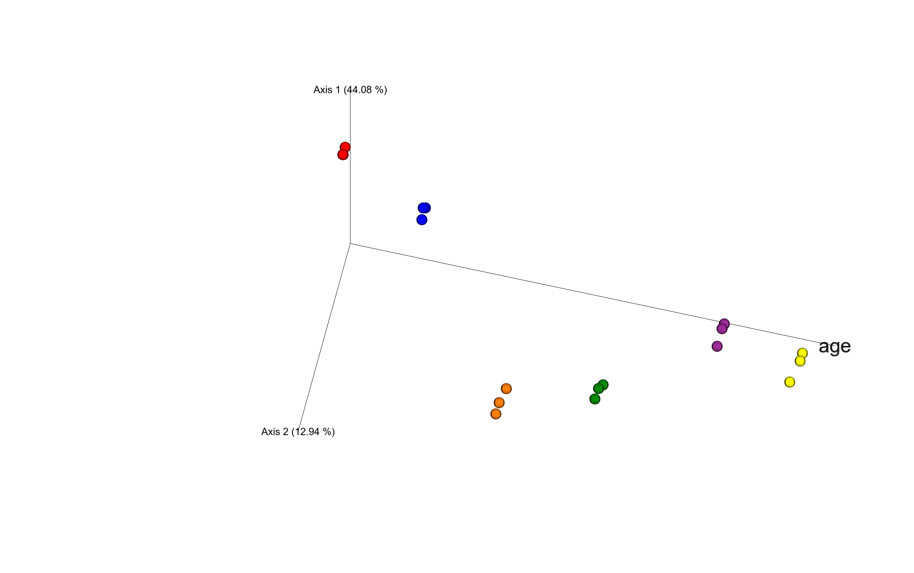
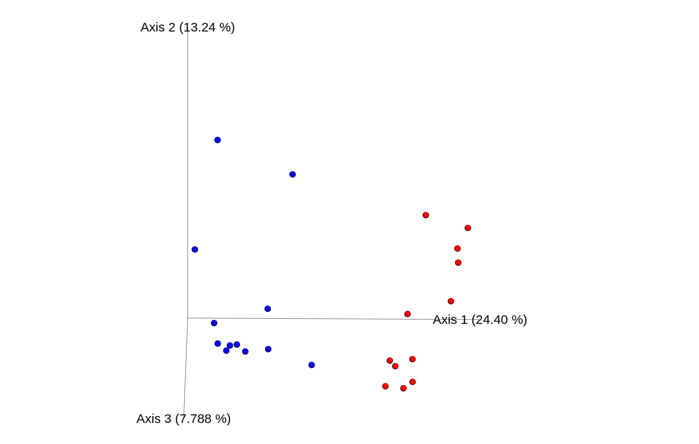
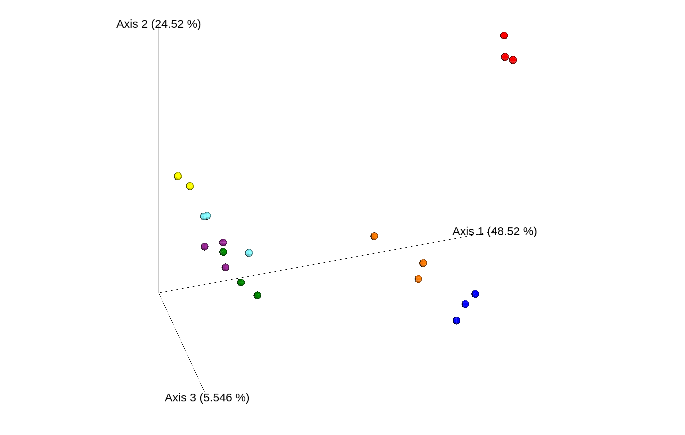

This is a QIIME 2 plugin to analyze metabolomics data that utilizes GNPS.

## Background

Mass spectrometry detects molecules via charged surrogates called ions (i.e. mass-to-charge, m/z). MS data contains MS1 spectra (i.e. spectrum of all ions; m/z and their respective abundance) and MS2 spectra (i.e. spectrum of structural fragments of an ion). MS2. spectra are generated by imparting excess internal energy into ions which causes them to dissociate into smaller mass fragments. Collision induced dissociation (CID) or higher-energy collision induced dissociation (HCD) are common methods applied to non-volatile ionized molecules to impart energy via collisions with gas molecules. One can collect both MS1 and MS2 spectra in a single experiment using data dependent acquisition (DDA), a common approach used in untargeted metabolomics. The data contains a series of MS1 spectra from which the n most abundant m/z values are selected and fragmented serially. This cycle continues throughout the analysis of a sample. Often, liquid chromatography (or chemical separation techniques) are combined with mass spectrometry to i) simplify sample complexity, ii) provide orthogonal information (e.g. retention time), and iii) increase coverage of the fragmentation approach to fragment more unique ions (e.g. isomers separated by chromatography can all be fragmented individually). Samples can be compared qualitatively and/or quantitatively using either MS1 or MS2 data or a combination of the two.

### MS2 Spectral Counts

If one were to collect data using DDA or similar method, multiple MS2 spectra from the sample ion (aka molecule) can be present in the data. One of the initial data analysis processes performed in GNPS (via MScluster) is to collapse identical spectra into a single molecular feature. The number of fragmentation spectra measured for each molecular feature (unique  ion) per sample, i.e. spectral counts, can be used as a semiquantitative estimate: i.e. the higher the spectral count, the more abundant the molecular feature will be as it triggered multiple fragmentation events.

### MS1 Peak Areas

Fundamentally, spectral abundance observed at a given time in a mass spectrum is related to concentration (imperfectly); however, integration of spectral abundance over time better represents the concentration of a particular compound  in the sample. Extraction ion chromatograms (XIC) are generated from all observed m/z in the MS1 of a sample, and the area under the curve (i.e. peak area) are determined via integration. Advantage of comparing samples using the MS1 peak area is that the quantitative information can be more accurate as well as more sensitively, particularly for those compounds of low abundance, as not all ions will be selected in the top n most abundant peaks and thus not trigger a MS2 fragmentation event.

## Installation

Install Qiime2 and activate environment by following the steps described [here](https://docs.qiime2.org/2018.6/install/native/).

Test if the Qiime2 installation was successful by typing the following command:

```
qiime
```

If Qiime2 was successfully installed, options will appear.

To install the q2_metabolomicsgnps plugin, you have two options

```
conda install -c mwang87 q2-metabolomicsgnps
```

or

```
git clone https://github.com/mwang87/q2_metabolomicsgnps
cd q2_metabolomicsgnps
pip install -e .
```

Test if the plugin was installed correctly by repeating the following command:

```
qiime
```

If successful, the metabolomics-gnps plugin is now listed in the options.

### Plugin Commands Listing

#### List all commands

```
qiime metabolomicsgnps
```

#### MS2 GNPS Clustering Command
This function will take as input a set of mass spectrometry files (mzXML or mzML) and a manifest file to produce a biom qza file:

```
qiime metabolomicsgnps gnps-clustering
```

##### Example:
```
qiime metabolomicsgnps gnps-clustering \
  --p-manifest data/manifest.tsv \
  --p-credentials data/credentials.json \
  --o-feature-table outputfolder
```

#### MS2 GNPS Clustering Command
This function will take as input an existing GNPS Molecular Networking task and a manifest file to produce a biom qza file:

```
qiime metabolomicsgnps gnps-clustering-taskimport
```

##### Example:

```
qiime metabolomicsgnps gnps-clustering \
  --p-manifest data/manifest.tsv \
  --p-taskid cde9c128ec0c48a58e650279f1735dbc \
  --o-feature-table outputfolder
```

#### MZmine2 Feature Import Command
This function will take as input a feature quantification file from MZmine2 and a manifest file and produce a biom qza file:

```
qiime metabolomicsgnps mzmine2-clustering
```

##### Example:

```
qiime metabolomicsgnps mzmine2-clustering \
  --p-manifest tests/data/mzminemanifest.csv \
  --p-quantificationtable tests/data/mzminefeatures.csv \
  --o-feature-table feature
```

### Input Data Description/Download Cross-Sectional Data

In this tutorial, we will download metabolomics data for use with the metabolomicsgnps plugin for QIIME 2. The dataset we will use for this tutorial contains cross sectional data from plant or animal sources.

Navigate to a directory of your choice (e.g. Example_CrossSectional)

```
cd Example_CrossSectional
```

Download the example raw data files (.mzML) from [MassIVE](ftp://massive.ucsd.edu/):

```
wget -m ftp://massive.ucsd.edu/MSV000082820/peak/
```

Download all other files you will need to run the example analyses:

```
wget -m ftp://massive.ucsd.edu/MSV000082820/other/
```

Note: The files contained within the folder “other” have been created for this example dataset. If you want to recreate the example analyses listed below with your own dataset, you will have to create your own [manifest.csv](link to manifest file description) and [metadata.txt](https://docs.qiime2.org/2018.6/tutorials/metadata/) files.

You will now find a folder named ‘massive.ucsd.edu’ within your working directory. To submit your raw data files (.mzML) to mass spectral molecular networking using GNPS as described below, move all your raw data files as well as the manifest.csv file within the same directory. Here we will move all above downloaded files within the directory ‘MSV000082821’.  

First, move the MSV000082820 subfolder to your working directory:

```
mv massive.ucsd.edu/MSV000082820/ .
```

All your files and subfolders are now within ‘MSV000082820’. The ‘massive.ucsd.edu’ should be empty and you can delete it by typing:

```
rm -rf massive.ucsd.edu/
```

Subsequently, move the ‘peak/data’ directory, where your raw data files are located to the ‘other’ directory, where your manifest.csv and metadata.txt table are:

```
mv MSV000082820/peak/data/ MSV000082820/other/
```

The MSV000082821/peak/ folder is now empty and you can remove it:

```
rm -rf MSV000082820/peak/
```

Proceed with typing the commands below, until all raw data files, as well as manifest and metadata files are within the folder MSV000082820:

```
mv MSV000082820/other/data/  MSV000082820/
mv MSV000082820/other/  MSV000082820/data/
mv  -v MSV000082820/data/other/*  MSV000082820/data/
rm -rf MSV000082820/data/other/
mv  -v MSV000082820/data/*  MSV000082820/
rm -rf MSV000082820/data/
```

### Input Data Description/Download Longitudinal Data

In this tutorial, we will download metabolomics data for use with the metabolomicsgnps plugin for QIIME 2. The dataset we will use for this tutorial contains longitudinal data on the fermentation process of milk to yogurt.

Navigate to a directory of your choice (e.g. Example_Longitudinal):

`cd Example_Longitudinal`

Download the example raw data files (.mzML) from [MassIVE](ftp://massive.ucsd.edu/):

`wget -m ftp://massive.ucsd.edu/MSV000082821/peak/`

Download all other files you will need to run the example analyses:

`wget -m ftp://massive.ucsd.edu/MSV000082821/other/`

Note: The files contained within the folder “other” have been created for this example dataset. If you want to recreate the example analyses listed below with your own dataset, you will have to create your own [manifest.csv](link to manifest file description) and [metadata.txt](https://docs.qiime2.org/2018.6/tutorials/metadata/) files.

You will now find a folder named ‘massive.ucsd.edu’ within your working directory. To submit your raw data files (.mzML) to mass spectral molecular networking using GNPS as described below, move all your raw data files as well as the manifest.csv file within the same directory. Here we will move all above downloaded files within the directory ‘MSV000082821’.  

First, move the MSV000082821 subfolder to your working directory:

`mv massive.ucsd.edu/MSV000082821/ .`

All your files and subfolders are now within ‘MSV000082821’. The ‘massive.ucsd.edu’ should be empty and you can delete it by typing:

`rm -rf massive.ucsd.edu/`

Subsequently, move the ‘peak/data’ directory, where your raw data files are located to the ‘other’ directory, where your manifest.csv and metadata.txt table are:

`mv MSV000082821/peak/data/ MSV000082821/other/`

The MSV000082821/peak/ folder is now empty and you can remove it:

`rm -rf MSV000082821/peak/`

Proceed with typing the commands below, until all raw data files, as well as manifest and metadata files are within the folder MSV000082821:

```
mv MSV000082821/other/data/  MSV000082821/
mv MSV000082821/other/  MSV000082821/data/
mv  -v MSV000082821/data/other/*  MSV000082821/data/
rm -rf MSV000082821/data/other/
mv  -v MSV000082821/data/*  MSV000082821/
rm -rf MSV000082821/data/
```

### MZmine2 Export

MZmine2 is used to find features in the data and calculate the area under the curve. A detailed tutorial for feature finding with MZmine2 can be found [here](https://ccms-ucsd.github.io/GNPSDocumentation/featurebasedmolecularnetworking/).

Upon finding all features according to the tutorial above, perform the following steps to export the features and their respective quantifications to be compatible with this Qiime2 plugin.

Select Export->CSV File

1. Specify .csv file name and location
2. Check “Export row ID”, “Export row m/z” and “Export row retention time”
3. Check “Peak area”



4. Hit OK
5. The generated .csv file can now be used directly for further processing in Qiime2 in the Feature Based Quantification Analysis

### Manifest File Format

The manifest file specifies the location of the files that will be processed by the metabolomicsgnps plugin. It is a .CSV formatted table that contains two columns (See Figure X below). The first column indicates the ‘sample-id’ for each file, while the second column indicates its corresponding relative file path (relative to where qiime commands are called). The gnps-clustering and the mzmine2-clustering tools are using both the same manifest file.

Figure X. View of the manifest file (.CSV format). The first column indicates the ‘sample-id’ for each file, while the second column indicates its corresponding relative file path. The example file can be [downloaded here](https://github.com/mwang87/q2_metabolomicsgnps/raw/master/q2_metabolomicsgnps/tests/data/manifest.tsv).




### GNPS Credentials File format
GNPS login credentials will be specified in json format, in the following example:

```
{
    "username": "your username",
    "password": "your password"
}
```

# Tutorials
In this tutorial, we will learn how to analyze metabolomics data using the metabolomicsgnps plugin for QIIME 2. We will leverage Global Natural Products Social Molecular Networking (GNPS) to make metabolomics data accessible within the QIIME 2 platform. We will then investigate the data by running some simple descriptive statistical analyses available through QIIME 2.

This tutorial contains two different approaches of analysis with two example data sets, respectively.

1) Spectrum Count Qualitative Analysis
a) Food Cross Sectional Study
b) Longitudinal Study
2) Feature Based Quantification Analysis
a) Food Cross Sectional Study
b) Longitudinal Study

The dataset we will use for this tutorial contains a) cross sectional data from plant or animal sources and b) longitudinal data on the fermentation process of milk to yogurt.

## 1) Spectrum Count Qualitative Analysis
### 1a) Tutorial for Spectrum Count Qualitative Analysis: Food Cross Sectional Study

In this tutorial, we will learn how to analyze metabolomics data using spectrum count qualitative analysis. The dataset we will use for this tutorial contains cross sectional data from plant or animal sources.

Before you submit your files to GNPS, navigate to the folder, where your raw data and manifest.csv file is located:

`cd MSV000082820/`

Now activate your qiime2 conda environment by typing:

`source activate qiime2-2018.6`

Submit your raw data files to mass spectral molecular networking using [GNPS](https://gnps.ucsd.edu/ProteoSAFe/static/gnps-splash.jsp):

Now we are ready to start using QIIME 2 commands with our data. For the first step, we will use the gnps-clustering method to perform GNPS mass spectral network analysis:

```
qiime metabolomicsgnps gnps-clustering \
  --p-manifest manifest.csv \
  --p-username [enter user GNPS username] \
  --p-password [enter user GNPS password] \
  --o-feature-table feature
```

Provide the name of your manifest.csv file, your GNPS username and password. Once the GNPS network analysis is finished, you will find the GNPS bucket table/feature table in .qza format within the directory you are currently in directory you specified. Your job will appear in your job list at gnps.ucsd.edu once the files are loaded into GNPS where you can then track progress.

We will now rename your GNPS feature table to something more descriptive “catagorical_ms2.qza”

`mv feature.qza catagorical_ms2.qza`

To generate visual and tabular summaries of your feature table, you can use the qiime [feature-table summarize](https://docs.qiime2.org/2018.2/plugins/available/feature-table/summarize/) function whilst staying in the output folder:

```
qiime feature-table summarize \
  --i-table catagorical_ms2.qza \
  --o-visualization table.qzv  \
  --m-sample-metadata-file metadata.txt
```

To generate a tabular view of your metadata file, you can use the [qiime metadata tabulate](https://docs.qiime2.org/2017.10/plugins/available/metadata/tabulate/) function. The output visualization enables interactive filtering, sorting, and exporting to common file formats:

```
qiime metadata tabulate \
  --m-input-file metadata.txt \
  --o-visualization tabulated-metadata.qzv
```

To compute the Shannon diversity index for all samples contained within your mass spectral feature table, use the qiime diversity alpha function:

```
qiime diversity alpha \
  --i-table catagorical_ms2.qza \
  --p-metric shannon \
  --o-alpha-diversity shannon.qza
```

The output file ‘shannon.qza’ contains the per sample Shannon diversity index. You can inspect a .qza file by using a Text Editor (e.g. TextWrangler).

To compute all pairwise canberra distances, you can use the qiime diversity beta function:

```
qiime diversity beta \
  --i-table catagorical_ms2.qza \
  --p-metric canberra \
  --output-dir canberra_qiime2
```

The output consists of a distance matrix, comprising the canberra distances of all pairs of samples provided in the mass spectral feature table. You can specify a distance metric of your choice using the --p-metric option (e.g. braycurtis, jaccard, mahalanobis, euclidean, etc.)

The resulting distance matrix can be used for PCoA analysis. To create PCos from the above created canberra matrix of pairwise distances type:

```
qiime diversity pcoa \
 --i-distance-matrix canberra_qiime2/distance_matrix.qza \
 --output-dir pcoa_canberra_qiime2
```

To create an interactive ordination plot of the above created PCoA with integrated sample metadata use the qiime emperor plot function. Make sure that the ‘sample-id’s provided in the metadata file correspond to the sample-ids in the canberra distance_matrix.qza file:

```
qiime emperor plot \
   --i-pcoa pcoa_canberra_qiime2/pcoa.qza \
   --m-metadata-file metadata.txt \
   --output-dir emperor_qiiime2`
```

To visualize the PCoA type:

```
qiime tools view emperor_qiime2/visualization.qzv
```

Or drag and drop [emperor_qiime2/visualization.qzv](/examplefiles/emperor_MS2based_cross-sectional.qzv?raw=true) to https://view.qiime2.org/




### 1b) Tutorial for Spectrum Count Qualitative Analysis: Longitudinal Study

In this tutorial, we will learn how to analyze metabolomics data using spectrum count qualitative analysis. The dataset we will use for this tutorial contains longitudinal data on the fermentation process of milk to yogurt.

Before you submit your files to GNPS, navigate to the folder, where your raw data and manifest.csv file is located:

`cd MSV000082821/`

Now activate your qiime2 conda environment by typing:

`source activate qiime2-2018.6`

If you do not remember the name of your qiime2 conda environment, you can get a list of all conda environments installed on your computer by typing:

`conda env list`

Submit your raw data files to mass spectral molecular networking using [GNPS](https://gnps.ucsd.edu/ProteoSAFe/static/gnps-splash.jsp):

Now we are ready to start using QIIME 2 commands with our data. For the first step, we will use the gnps-clustering method to perform GNPS mass spectral network analysis:

```
qiime metabolomicsgnps gnps-clustering \
  --p-manifest manifest_longitudinal.csv \
  --p-username USERNAME \
  --p-password PASSWORD
  --output-dir out
```

Provide the name of your manifest.csv file, your GNPS username and password and specify an output directory of your choice (here “out”). Once the GNPS network analysis is finished, you will find the GNPS bucket table/feature table in .qza format within the output directory you specified.

Perform descriptive statistical analyses of the mass spectral feature table retrieved from GNPS using qiime2

Below examples of simple descriptive statistical analyses are given, which can be performed on your mass spectral feature table using qiime2. For any qiime2 function used below you can retrieve a brief description and information about parameters using the --help option. For example, to retrieve a description of the qiime diversity beta function type:

`qiime diversity beta --help`

Generate visual and tabular summaries of a feature table

To generate visual and tabular summaries of your feature table, you can use the qiime [feature-table summarize](https://docs.qiime2.org/2018.2/plugins/available/feature-table/summarize/) function:

```
qiime feature-table summarize \
  --i-table out/feature_table.qza \
  --o-visualization tableSummary_spectralCounts_longitudinal.qzv
```

This will create a qiime [`tableSummary_spectralCounts_longitudinal.qzv`](https://github.com/mwang87/q2_metabolomicsgnps/blob/master/examplefiles/tableSummary_spectralCounts_longitudinal.qzv?raw=true) object, you can open it by typing:

```
qiime tools view tableSummary_spectralCounts_longitudinal.qzv
```

Or drag and drop to:
`https://view.qiime2.org/`

Generate a tabular view of Metadata

To generate a tabular view of your metadata file, you can use the [qiime metadata tabulate](https://docs.qiime2.org/2017.10/plugins/available/metadata/tabulate/) function. The output visualization enables interactive filtering, sorting, and exporting to common file formats:

```
qiime metadata tabulate \
  --m-input-file metadata_longitudinal.txt \
  --o-visualization tabulated-metadata.qzv
```

Compute the Shannon diversity index for all samples

To compute the Shannon diversity index for all samples contained within your mass spectral feature table, use the qiime diversity alpha function:

```
qiime diversity alpha \
  --i-table out/feature_table.qza \
  --p-metric shannon \
  --o-alpha-diversity shannon.qza
```

The output file ‘shannon.qza’ contains the per sample Shannon diversity index. You can inspect a .qza file by using a Text Editor (e.g. TextWrangler).

Compute pairwise canberra distances and visualization in interactive PCoA space

To compute all pairwise canberra distances, you can use the qiime diversity beta function:

```
qiime diversity beta \
  --i-table out/feature_table.qza \
  --p-metric canberra \
  --output-dir canberra_qiime2
```

The output consists of a distance matrix, comprising the canberra distances of all pairs of samples provided in the mass spectral feature table. You can specify a distance metric of your choice using the --p-metric option (e.g. braycurtis, jaccard, mahalanobis, euclidean, etc.)

The resulting distance matrix can be used for PCoA analysis. To create PCos from the above created canberra matrix of pairwise distances type:

```
qiime diversity pcoa \
  --i-distance-matrix canberra_qiime2/distance_matrix.qza \
  --output-dir pcoa_canberra_qiime2
```

To create an interactive ordination plot of the above created PCoA with integrated sample metadata use the qiime emperor plot function. Make sure that the ‘sample-id’s provided in the metadata file correspond to the sample-ids in the canberra distance_matrix.qza file:

```
qiime emperor plot \
  --i-pcoa pcoa_canberra_qiime2/pcoa.qza \
  --m-metadata-file metadata_longitudinal.txt \
  --output-dir emperor_qiime2
```

To visualize the PCoA type :

`qiime tools view emperor_qiime2/visualization.qzv`

Or drag and drop emperor_qiime2/visualization.qzv to https://view.qiime2.org/

Here is an example file for [`emperor_qiime2/visualization.qzv`](https://github.com/mwang87/q2_metabolomicsgnps/blob/master/examplefiles/pcoa_spectralCounts_longitudinal.qzv?raw=true)

You should be able to create the following visualization:




Here, we can for example depict chemical differences of milk samples during the fermentation process to yogurt (black: milk, red to blueblue to red: milk with yogurt culture at different stages of the fermentation process from 0 to 58 hours. to yogurt, black: yogurt).

#### Test whether groups of samples are significantly different from one another using a Permutational multivariate analysis of variance (PERMANOVA)

To test whether the chemistry of the milk samples differs significantly during the fermentation process to yogurt, we can apply a Permutational multivariate analysis of variance (PERMANOVA) to our categorical metadata category ‘age’ using qiime2:

To execute this function, we will provide the distance matrix found in the canberra_qiime2 directory, the longitudinal metadata file, a category of metadata to compute upon (in this case 'age'), an output artifact name, and the option pairwise.

```
qiime diversity beta-group-significance \
  --i-distance-matrix canberra_qiime2/distance_matrix.qza \
  --m-metadata-file metadata_longitudinal.txt \
  --m-metadata-column age \
  --o-visualization PERMANOVA_spectralCounts_longitudinal.qzv \
  --p-pairwise
```

To visualize the results of [`PERMANOVA_spectralCounts_longitudinal.qzv`](https://github.com/mwang87/q2_metabolomicsgnps/blob/master/examplefiles/PERMANOVA_spectralCounts_longitudinal.qzv?raw=true):

`qiime tools view PERMANOVA_spectralCounts_longitudinal.qzv`

#### Filter mass spectral feature table based on a metadata category

Sometimes before performing any of the above analyses you will want to filter out samples from your original mass spectral feature table. For example, large datasets may be computationally intensive, so filtering them down to just the data we’re interested in before downstream analysis can be advantageous.

You can do this directly from your mass spectral feature table in the .qza format using the qiime feature-table filter-samples function. To create a feature table containing only milk samples during different stages of the fermentation process to yogurt, without including the yogurt samples (exclude ‘not applicable’ in the metadata category ‘age’), type:

```
qiime feature-table filter-samples \
  --i-table out/feature_table.qza \
  --m-metadata-file metadata_longitudinal.txt \
  --p-where "age='not applicable'" \
  --p-exclude-ids \
  --o-filtered-table age-table.qza
```


You can now repeat all of the above analyses by substituting the feature_table.qza with the new, filtered output feature table file created here: age-table.qza.

```
qiime metabolomicsgnps gnps-clustering \
  --p-manifest manifest_longitudinal_age.csv
  --p-username USERNAME \
  --p-password PASSWORD
  --output-dir out_age
```

```
qiime diversity beta \
  --i-table age-feature_table.qza \
  --p-metric canberra \
  --output-dir canberra_age_qiime2
```

```
qiime diversity pcoa \
  --i-distance-matrix canberra_age_qiime2/distance_matrix.qza \
  --output-dir pcoa_canberra_age_qiime2
```

You can also include a numeric sample metadata column as axis in the Emperor plot. To select the ‘age’ metadata category, which you now filtered for numeric metadata only do:

```
qiime emperor plot \
  --i-pcoa pcoa_canberra_age_qiime2/pcoa.qza \
  --m-metadata-file metadata_longitudinal_age.txt \
  --p-custom-axes age \
  --output-dir emperor_qiime2_custom_axe_age
```

```
qiime tools view emperor_qiime2_custom_axe_age/visualization.qzv
```

Here is an example file for [`emperor_qiime2_custom_axe_age/visualization.qzv`](https://github.com/mwang87/q2_metabolomicsgnps/blob/master/examplefiles/pcoaFixedAxis_spectralCounts_longitudinal.qzv?raw=true)

You should be able to create the following visualization:



## 2) Feature Based Quantification Analysis

```
source activate qiime2-2018.6

qiime metabolomicsgnps mzmine2-clustering \
--p-manifest
--p-quantificationtable
--o-feature-table feature
```

To create “quantificationtable” please follow the steps outlined in the tutorial “Qiime2 - MZmine export – Documentation”

### 2a) Tutorial for Feature Based Quantification Analysis: Food Cross Sectional Study
In this tutorial, we will learn how to analyze metabolomics data feature based quantification. The dataset we will use for this tutorial contains cross sectional data from plant or animal sources.

#### Specify the path to manifest file and mzmine2 feature table
This step creates qza file for further analysis in Qiime2

```
qiime metabolomicsgnps mzmine2-clustering \
--p-manifest manifest_cat.csv  \
--p-quantificationtable Feature_Table_Cat.csv \
--o-feature-table feature_mzmine2_cat.qza
```

#### Create a summary table
This step creates qzv file for further visualization in qiime2 view (https://view.qiime2.org/)

```
qiime feature-table summarize \
--i-table feature_mzmine2_cat.qza \
--o-visualization table_cat.qzv \
--m-sample-metadata-file metadata_cat.txt
```

This will create a qiime [`tableSummary_peakAreas_cross-sectional.qzv`](https://github.com/mwang87/q2_metabolomicsgnps/blob/master/examplefiles/tableSummary_peakAreas_cross-sectional.qzv?raw=true) object, you can open it by typing:

`qiime tools view tableSummary_peakAreas_cross-sectional.qzv`

Or drag and drop to:
`https://view.qiime2.org/`

Generate a tabular view of Metadata

#### Compute the Shannon diversity index for all samples

To compute the Shannon diversity index for all samples contained within your MS1 feature table, use the Qiime diversity alpha function:

```
qiime diversity alpha \
  --i-table feature_mzmine2_cat.qza \
  --p-metric shannon \
  --o-alpha-diversity shannon.qza
  ```

The output file ‘shannon.qza’ contains the Shannon diversity index for each sample. You can inspect the .qza file by using a Text Editor (e.g. TextWrangler).

#### Compute pairwise canberra distances and visualization in interactive PCoA space

To compute all pairwise canberra distances, you can use the qiime diversity beta function:

```
qiime diversity beta \
  --i-table feature_mzmine2_cat.qza \
  --p-metric canberra \
  --output-dir canberra_qiime2
```

The output consists of a distance matrix, comprising the canberra distances of all pairs of samples provided in the mass spectral feature table. You can specify a distance metric of your choice using the --p-metric option (e.g. braycurtis, jaccard, mahalanobis, euclidean, etc.)

The resulting distance matrix can be used for PCoA analysis. To create PCos from the above created canberra matrix of pairwise distances type:

`qiime diversity pcoa \
  --i-distance-matrix canberra_qiime2/distance_matrix.qza \
  --output-dir pcoa_canberra_qiime2`

To create an interactive ordination plot of the above created PCoA with integrated sample metadata use the qiime emperor plot function. Make sure that the ‘sample-id’s provided in the metadata file correspond to the sample-ids in the canberra distance_matrix.qza file:

```
qiime emperor plot \
  --i-pcoa pcoa_canberra_qiime2/pcoa.qza \
  --m-metadata-file metadata_cat.txt \
  --output-dir emperor_qiime2
```

To visualize the PCoA type:

```
qiime tools view emperor_qiime2/visualization.qzv
```

Or drag and drop emperor_qiime2/visualization.qzv to https://view.qiime2.org/

Here is an example file for [`emperor_qiime2/visualization.qzv`](https://github.com/mwang87/q2_metabolomicsgnps/blob/master/examplefiles/pcoa_peakAreas_cross-sectional.qzv?raw=true)

You should be able to create the following visualization:



### 2b) Tutorial for Feature Based Quanitification Analysis: Longitudinal Study
In this tutorial, we will learn how to analyze metabolomics data using feature based quantification analysis. The dataset we will use for this tutorial contains longitudinal data on the fermentation process of milk to yogurt.

#### Specify the path to manifest file and mzmine2 feature table
This step creates qza file for further analysis in qiime2

```
qiime metabolomicsgnps mzmine2-clustering \
--p-manifest manifest_long.csv \
--p-quantificationtable Feature_Table_long.csv \
--o-feature-table feature_mzmine2_long
```

#### Perform descriptive statistical analyses of the mass spectral feature table created using mzmine2

Below examples of simple descriptive statistical analyses are given, which can be performed on your mzmine2(ms1) feature table using qiime2. For any qiime2 function used below you can retrieve a brief description and information about parameters using the --help option. For example, to retrieve a description of the qiime diversity beta function type:

`qiime diversity beta --help`

#### Generate visual and tabular summaries of a feature table

To generate visual and tabular summaries of your feature table, you can use the qiime [feature-table summarize](https://docs.qiime2.org/2018.2/plugins/available/feature-table/summarize/) function:

```
qiime feature-table summarize \
--i-table feature_mzmine2_long.qza \
--o-visualization table_long.qzv \
--m-sample-metadata-file metadata_long.txt
```

This will create a qiime .qzv object, you can open it by typing:

`qiime tools view table_long.qzv`

Or drag and drop to:
https://view.qiime2.org/

#### Generate a tabular view of Metadata

To generate a tabular view of your metadata file, you can use the [qiime metadata tabulate] (https://docs.qiime2.org/2017.10/plugins/available/metadata/tabulate/) function. The output visualization enables interactive filtering, sorting, and exporting to common file formats:

```
qiime metadata tabulate \
--m-input-file metadata_long.txt \
--o-visualization tabulated-metadata.qzv
```

This will create a qiime [`tableSummary_peakAreas_longitutional.qzv`](https://github.com/mwang87/q2_metabolomicsgnps/blob/master/examplefiles/tableSummary_peakAreas_longitutional.qzv?raw=true) object, you can open it by typing:

`qiime tools view tableSummary_peakAreas_cross-sectional.qzv`

Or drag and drop to:
`https://view.qiime2.org/`

Generate a tabular view of Metadata

#### Compute the Shannon diversity index for all samples

To compute the Shannon diversity index for all samples contained within your mzmine2(ms1) feature table, use the qiime diversity alpha function:

```
qiime diversity alpha \
--i-table feature_mzmine2_long.qza \
--p-metric shannon \
--o-alpha-diversity shannon.qza
```

The output file ‘shannon.qza’ contains the per sample Shannon diversity index. You can inspect a .qza file by using a Text Editor (e.g. TextWrangler).

#### Compute pairwise canberra distances and visualization in interactive PCoA space

To compute all pairwise canberra distances, you can use the qiime diversity beta function:

```
qiime diversity beta \
--i-table feature_mzmine2_long.qza \
--p-metric canberra \
--output-dir canberra_qiime2
```

The output consists of a distance matrix, comprising the canberra distances of all pairs of samples provided in the mass spectral feature table. You can specify a distance metric of your choice using the --p-metric option (e.g. braycurtis, jaccard, mahalanobis, euclidean, etc.)

The resulting distance matrix can be used for PCoA analysis. To create PCos from the above created canberra matrix of pairwise distances type:

```
qiime diversity pcoa \
--i-distance-matrix canberra_qiime2/distance_matrix.qza \
--output-dir pcoa_canberra_qiime2
```

To create an interactive ordination plot of the above created PCoA with integrated sample metadata use the qiime emperor plot function. Make sure that the ‘sample-id’s provided in the metadata file correspond to the sample-ids in the canberra distance_matrix.qza file:

```
qiime emperor plot \
--i-pcoa pcoa_canberra_qiime2/pcoa.qza \
--m-metadata-file metadata_long.txt \
--output-dir emperor_qiime2
```

To visualize the PCoA type:

`qiime tools view emperor_qiime2/visualization.qzv`

Or drag and drop emperor_qiime2/visualization.qzv to https://view.qiime2.org/

Here is an example file for [`emperor_qiime2/visualization.qzv`](https://github.com/mwang87/q2_metabolomicsgnps/blob/master/examplefiles/pcoa_peakAreas_longitutinal.qzv?raw=true)

You should be able to create the following visualization:



#### Test whether groups of samples are significantly different from one another using a Permutational multivariate analysis of variance (PERMANOVA)

To test whether the chemistry of the milk samples differs significantly during the fermentation process to yogurt, we can apply a Permutational multivariate analysis of variance (PERMANOVA) to our categorical metadata category ‘age’ using qiime2:

To execute this function, we will provide the distance matrix found in the canberra_qiime2 directory, the longitudinal metadata file, a category of metadata to compute upon (in this case 'age'), an output artifact name, and the option pairwise.

```
qiime diversity beta-group-significance \
  --i-distance-matrix canberra_qiime2/distance_matrix.qza \
  --m-metadata-file metadata_longitudinal.txt \
  --m-metadata-column age \
  --o-visualization PERMANOVA_peakAreas_longitudinal.qzv \
  --p-pairwise
```

To visualize the results of [`PERMANOVA_peakAreas_longitudinal.qzv`](https://github.com/mwang87/q2_metabolomicsgnps/blob/master/examplefiles/PERMANOVA_peakAreas_longitudinal.qzv?raw=true):

`qiime tools view PERMANOVA_peakAreas_longitudinal.qzv`
